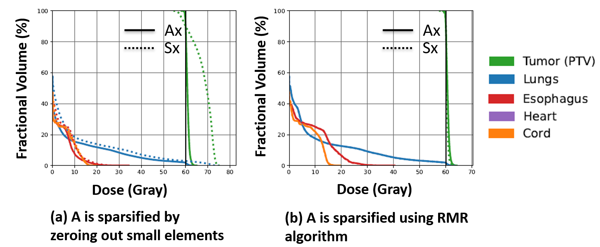
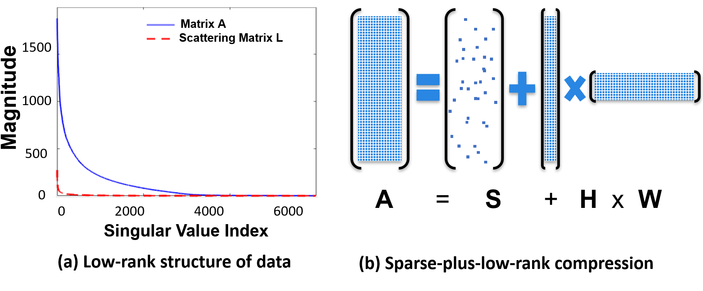

<p align="center">
  
</p>


<h1 align="center">Compressed Radiation Treatment Planning (CompressRTP)</h1>

<h2 align="center">
  <a href="./images/RMR_NeurIPS_Paper.pdf">NeurIPS'2024 </a> | 
    <a href="https://arxiv.org/abs/2410.00756">ArXiv'2024 </a> |
  <a href="https://iopscience.iop.org/article/10.1088/1361-6560/acbefe/meta">PMB'2023</a>

</h2>


# What is CompressRTP?

Radiotherapy is used to treat more than half of all cancer patients, either alone or in combination with other treatments like surgery, chemotherapy, or immunotherapy. It works by directing high-energy radiation beams at the patient's body to destroy cancer cells. Since every patient's anatomy is unique, radiotherapy must be personalized. This means customizing the radiation beams to effectively target the tumor while minimizing harm to nearby healthy tissue.

Personalizing radiotherapy involves solving large and complex optimization problems. These problems need to be solved quickly due to the limited time available in clinical settings. Currently, they are often solved using gross approximations, which can lead to less effective treatments. This might result in the tumor not receiving enough radiation or healthy tissues being exposed to excessive radiation. The CompressRTP project aims to solve these optimization problems both rapidly and accurately. This ongoing project currently includes tools introduced in our latest three publications [1, 2, 3]. 

# High-Level Overview
The optimization problems in radiotherapy are highly complex due to the "curse of dimensionality" since they involve many beams, beamlets (small segments of beams), and voxels (3D pixels representing volume). However, much of this data is redundant because it comes from discretizing a system that is inherently continuous. For example, radiation doses delivered from adjacent beamlets are highly correlated, and radiation doses delivered to neighboring voxels are very similar. This redundancy means that large-scale radiotherapy optimization problems are highly compressible, which is the foundation of **CompressRTP**.

Dimensionality reduction and compression have a rich history in statistics and engineering. Recently, these techniques have re-emerged as powerful tools for addressing increasingly high-dimensional problems in fields like big data and machine learning. Our goal is to **adapt and adopt** these versatile methods to **embed high-dimensional** radiotherapy optimization problems into **lower-dimensional spaces** so they can be solved efficiently. A general radiotherapy optimization problem can be formulated as:

$Minimize \text{ } f(A\mathbf{x},\mathbf{x})$

Subject to $g(A\mathbf{x},\mathbf{x})\leq 0,\mathbf{x}\geq 0$
​

**CompressRTP** currently addresses the following two issues with this problem:

1. **Matrix Compression to Address the Computational Intractability of $A$:**

    - **The Challenge:** The matrix $𝐴$ is large and dense (approximately 100,000–500,000 rows and 5,000–20,000 columns) and is the main source of computational difficulty in solving radiotherapy optimization problems.
    - **Traditional Approach:** This matrix is often sparsified in practice by simply ignoring small elements (e.g., zeroing out elements less than 1% of the maximum value in $𝐴$), which can potentially lead to sub-optimal treatment plans.
    - **CompressRTP Solutions:** We provide a compressed and accurate representation of matrix $𝐴$ using two different techniques:
      - **(1.1) Sparse-Only Compression:** This technique sparsifies $𝐴$ using advanced tools from probability and randomized linear algebra. ([NeurIPS paper](./images/RMR_NeurIPS_Paper.pdf), [Sparse-Only Jupyter Notebook](https://github.com/PortPy-Project/CompressRTP/blob/main/examples/matrix_sparse_only.ipynb))
      - **(1.2) Sparse-Plus-Low-Rank Compression:** This method decomposes $𝐴$ into a sum of a sparse matrix and a low-rank matrix. ([ArXiv paper](https://arxiv.org/abs/2410.00756), [Sparse-Plus-Low-Rank Jupyter Notebook](https://github.com/PortPy-Project/CompressRTP/blob/main/examples/matrix_sparse_plus_low_rank.ipynb))
2. **Fluence Compression to Enforce Smoothness on $𝑥$:**
    - **The Need for Smoothness:** The beamlet intensities $𝑥$ need to be smooth for efficient and accurate delivery of radiation. Smoothness refers to small variations in the intensity of neighboring beamlets in two dimensions.
    - **Traditional Approach:** Smoothness is often achieved implicitly by adding regularization terms to the objective function that discourage variations between neighboring beamlets.
    - **CompressRTP Solution:** We enforce smoothness explicitly by representing the beamlet intensities using low-frequency wavelets, resulting in built-in wavelet-induced smoothness. This can be easily integrated into the optimization problem by adding a set of linear constraints.  ([PMB paper](https://iopscience.iop.org/article/10.1088/1361-6560/acbefe/meta), [Wavelet Jupyter Notebook](https://github.com/PortPy-Project/CompressRTP/blob/main/examples/fluence_wavelets.ipynb))


# 1) Matrix Compression to Address the Computational Intractability of $𝐴$

## 1.1) Sparse-Only Matrix Compression
Matrix sparsification has been extensively studied in the machine learning community for applications such as low-rank approximation and Principal Component Analysis (PCA). This technique is also a key part of an emerging field known as randomized linear algebra. The main idea is to carefully sample and scale elements from the original dense matrix $𝐴$ to create a sparse "sketch" matrix $𝑆$ that closely resembles the characteristics of $𝐴$ (for example, ensuring that 
$||A-S||_2$ is small).

In radiotherapy optimization, we can replace the original dense matrix $A$ with this sparse matrix $S$ and solve the following surrogate optimization problem:

$Minimize \text{ } f(S\mathbf{x},\mathbf{x})$

Subject to $g(S\mathbf{x},\mathbf{x})\leq 0,\mathbf{x}\geq 0$
$(S≈A,S$ is sparse, $A$ is dense)


In our [paper](./images/RMR_NeurIPS_Paper.pdf), we introduced **Randomized Minor Rectification (RMR)**, a simple yet effective matrix sparsification algorithm equiped with robust mathematical properties. The core principle of RMR is to **deterministically retain the large elements of a matrix while probabilistically handling the smaller ones**. Specifically, the RMR algorithm converts a dense matrix $𝐴$ into a sparse matrix $𝑆$ with typically 2–4% non-zero elements. This sparsification ensures that the optimal solution to the surrogate optimization problem (where $𝐴$ is replaced by 
$S$) remains a near-optimal solution for the original problem. For a detailed mathematical analysis, refer to Theorems 3.6 and 3.9 in our [paper](./images/RMR_NeurIPS_Paper.pdf).
​
<p align="center">

<p>

**Figure Explanation:** The figure above compares the proposed RMR algorithm with four existing sparsification algorithms in terms of feasibility and optimality gaps. These gaps were calculated by solving both the original and surrogate optimization problems for 10 lung cancer patients, whose data is publicly available on PortPy. The results demonstrate that the RMR algorithm outperforms the existing methods.

<p align="center">

<p>

**Figure Explanation:** The figure above illustrates the discrepancies in Dose Volume Histogram (DVH) plots between the actual dose ($A\mathbf{x}$, shown as a solid line) and the approximated dose ($𝑆\mathbf{x}$, shown as a dotted line), where 
$\mathbf{x}$ is the optimal solution of the surrogate optimization problem. A smaller gap between the dotted and solid lines indicates a more accurate dose approximation. **Left figure** demonstrates a significant dose discrepancy when the matrix 
$A$ is sparsified by simply zeroing out small elements—a technique commonly used in practice. **Right figure** shows a minimal dose discrepancy when the matrix $A$ is sparsified using the RMR algorithm. Importantly, in both cases, the sparsified matrix contained only 2% non-zero elements. 


**Implementation in PortPy:**

If you are using PortPy for your radiotherapy research, you can apply RMR sparsification by simply adding the following lines of code. For more details, see [Sparse-Only Jupyter Notebook](https://github.com/PortPy-Project/CompressRTP/blob/main/examples/matrix_sparse_only.ipynb).

```python
from compress_rtp.utils.get_sparse_only import get_sparse_only

# Apply RMR sparsification to the matrix A
S = get_sparse_only(matrix=A, threshold_perc=10, compression='rmr')

# Replace the original matrix A with the sparsified matrix S
inf_matrix.A = S
```

## 1.2) Sparse-Plus-Low-Rank Matrix Compression
The rows of matrix $𝐴$ correspond to the patient's voxels, and the similarity of doses delivered to neighboring voxels makes these rows highly correlated (the same argument applies to the columns). This high correlation means that matrix $𝐴$
is **low-rank** and therefore **compressible**. 

<p align="center">

<p>
  
**Figure Explanation:** The low-rank nature of matrix $𝐴$ can be verified by observing the exponential decay of its singular values, as shown by the blue line in the **left figure**. If we decompose matrix 
$A$ into $A=S+L$,  where $𝑆$ is a sparse matrix containing large-magnitude elements (e.g., elements greater than 1% of the maximum value of $𝐴$), and $𝐿$ includes smaller elements mainly representing scattering doses, then the singular values of the scattering matrix $𝐿$ reveal an even sharper exponential decay (depicted by the red line). This suggests the use of “sparse-plus-low-rank” compression, $𝐴≈𝑆+𝐻𝑊$, as schematically shown in the **right figure**. 


The matrix $S$ is sparse, $H$ is a “tall skinny matrix” with only a few columns, and $W$ is a “wide short matrix” with only a few rows. Therefore, $A≈S+HW$ provides a compressed representation of the data. This allows us to solve the following surrogate problem instead of the original problem

$Minimize \text{ } f(S\mathbf{x}+H\mathbf{y},\mathbf{x})$

Subject to $g(S\mathbf{x}+H\mathbf{y},\mathbf{x})\leq 0, \mathbf{y}=W\mathbf{x}, \mathbf{x}\geq 0$

Decomposing a matrix into the sum of a sparse matrix and a low-rank matrix has found numerous applications in fields such as computer vision, medical imaging, and statistics. Historically, this structure has been employed as a form of prior knowledge to recover objects of interest that manifest themselves in either the sparse or low-rank components. However, the application presented here represents a novel departure from conventional uses of sparse-plus-low-rank decomposition. Unlike traditional settings where specific components (sparse or low-rank) hold intrinsic importance, our primary goal is not to isolate or interpret these structures. Instead, we leverage them for computationally efficient matrix representation. In this case, the structure serves purely as a tool for optimizing computational efficiency while maintaining data integrity.

**Note:** Both sparse-only and sparse-plus-low-rank compression techniques serve the same purpose. We are currently investigating the strengths and weaknesses of each technique and their potential combination. Stay tuned for more results.

**Implementation in PortPy:**

In PortPy, you can apply the sparse-plus-low-rank compression using the following lines of code. Unlike the sparse-only compression using RMR, which did not require any changes other than replacing $A\mathbf{x}$ with $S\mathbf{x}$ in your optimization formulation and code, this compression requires adding a linear constraint $y=W\mathbf{x}$ and replacing $Ax$ with $S\mathbf{x}+H\mathbf{y}$. These changes can be easily implemented using CVXPy (see the [Sparse-Plus-Low-Rank Jupyter Notebook](https://github.com/PortPy-Project/CompressRTP/blob/main/examples/matrix_sparse_plus_low_rank.ipynb) for details).

```python
from compress_rtp.utils.get_sparse_plus_low_rank import get_sparse_plus_low_rank

S, H, W = get_sparse_plus_low_rank(A=A, threshold_perc=1, rank=5)
```


## 2) Fluence Compression to Enforce Smoothness on $x$

The fluence smoothness required for efficient and accurate plan delivery is typically achieved by adding an additional "regularization" term to the objective function. This term measures local variations in adjacent beamlets to discourage fluctuating beamlet intensities. However, a significant limitation of this method is its focus on **local complexity** within each beam—it assesses variations between adjacent beamlets but overlooks the **global complexity** of the entire plan. Another challenge is that achieving an optimal balance between plan complexity and dosimetric quality requires careful fine-tuning of the importance weight associated with the smoothness term in the objective function.

To address these challenges, we treat the intensity map of each beam as a **2D image** and represent it using wavelets corresponding to **low-frequency changes**. The compressed representation of fluence using low-frequency wavelets induces built-in local and global smoothness that can be achieved **without any hyperparameter fine-tuning**. This approach can be easily incorporated into the optimization by adding a set of linear constraints in the form of $𝑥=𝑊𝑦$, where $W$ is the matrix including low-frequency wavelets.


<p align="center">

<p>

**Figure Explanation:** As illustrated in the figure above, the treatment plan achieved using wavelet compression is not only more conformal to the tumor but also less complex. This is evidenced by a smaller duty cycle compared to the plan achieved by adding only a regularization term to the objective function.


**Implementation in PortPy:** 

In **PortPy**, you can incorporate wavelet smoothness by adding the following lines of code. For detailed explanation, see [Wavelet Jupyter Notebook](https://github.com/PortPy-Project/CompressRTP/blob/main/examples/fluence_wavelets.ipynb).

```python
from compress_rtp.utils.get_low_dim_basis import get_low_dim_basis

# Generate the matrix W of low-frequency wavelets
W = get_low_dim_basis(inf_matrix=inf_matrix, compression='wavelet')

# Add the variable y
y = cp.Variable(W.shape[1])

# Add the constraint Wy = x
opt.constraints += [W @ y == opt.vars['x']]
```

# Team <a name="Team"></a>

| Name                                                                         | Institution                            |
|------------------------------------------------------------------------------|----------------------------------------|
| [Mojtaba Tefagh](https://www.ed.ac.uk/profile/mojtaba-tefagh)                | University of Edinburgh, Scotland      |
| [Gourav Jhanwar](https://github.com/gourav3017)                              | Memorial Sloan Kettering Cancer Center |
| [Masoud Zarepisheh](https://masoudzp.github.io/)                             | Memorial Sloan Kettering Cancer Center |


## License
CompressRTP code is distributed under **Apache License 2.0 with Commons Clause**, and is available for non-commercial academic purposes.

## Reference 

```

@article{Adeli2024Randomized,
  title={Randomized Sparse Matrix Compression for
Large-Scale Constrained Optimization in Cancer
Radiotherapy},
  author={Adeli, Shima and Tefagh, Mojtaba and Jhanwar, Gourav and Zarepisheh, Masoud},
  journal={accepted at NeurIPS},
  year={2024}
}


@article{tefagh2023built,
  title={Built-in wavelet-induced smoothness to reduce plan complexity in intensity modulated radiation therapy (IMRT)},
  author={Tefagh, Mojtaba and Zarepisheh, Masoud},
  journal={Physics in Medicine \& Biology},
  volume={68},
  number={6},
  pages={065013},
  year={2023},
  publisher={IOP Publishing}
}

@article{tefagh2024compressed,
  title={Compressed radiotherapy treatment planning (CompressRTP): A new paradigm for rapid and high-quality treatment planning optimization},
  author={Tefagh, Mojtaba and Jhanwar, Gourav and Zarepisheh, Masoud},
  journal={arXiv preprint arXiv:2410.00756},
  year={2024}
}


```

